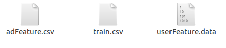
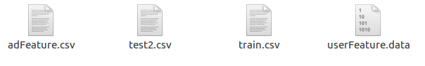
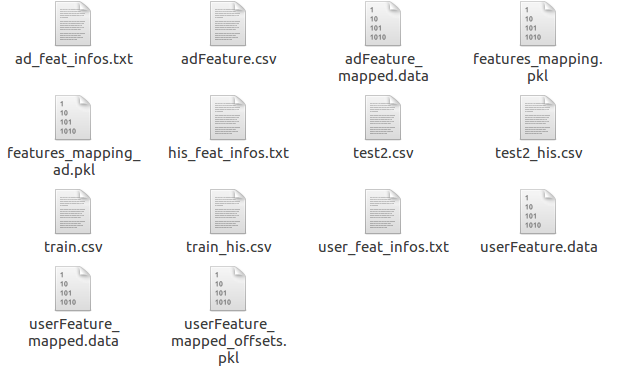
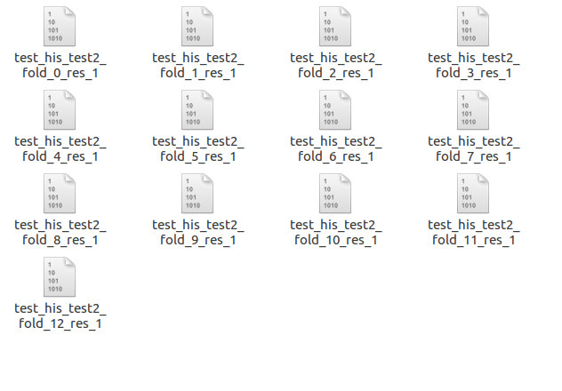

# SML_21
* He Jiang

* Yu Shi (Team Leader) 

* Hongyi Huang

This is our solutoin to __Tencent 2018 Advertisement Competition__. We rank __the 3rd place__ in the final leaderboard. 


Our model is simply an average of FFM-based Neural Networks with attention.
In the final submission, we use 13 such networks. But those networks are only different in their random seeds, which is a bad ensemble actually.
So, we guess 5 such networks will give almost the same result. Training on different subsets of the dataset and maybe on different subsets of features should 
give better results. For details of this model, see _Model_ section.


## Data
__NOTE__ that we don't provide the datasets. This model should work on other datasets 

## Requirements

### Hardwares
Our experiments are conducted on a server with 4 GTX 1080 Ti (11G gpu memory is required as we use a large batch size. We
only use 1 gpu at a time), 252G cpu memory (To run our codes directly, 150G cpu memory should be ok) and 16 cpus.

The large consumption of cpu memory is related to python multiprocessing libraries in Pytorch DataLoader class. 
It is also related to our implementation, we directly load users information, advertisement information and 
training/valid/test data into memory without using something like databases. Note memory comsumption here is also related to the large dataset provided by Tencent(Thanks!).

If we use single process to load data, the memory consumption would be much lower but time consumption would be much 
larger. We guess the problem is that when using multiprocessing, child process forks its parent and copy large objects 
like users' information, etc. We do try to debug it in competition, but we haven't solved it. 

The memory issue is a __known bug__. We don't have any plan to fix it, however. 
Indeed, we have aleady used a chunking trick to reduce memory comsumption. 
By adjusting the number of workers in data loader and chunk size, we can reduce the memory consumption. 

But we guess it is hardly possible to run the codes directly unless you have a powerful server or you modify the implementation of io, like using a database or spliting the files.

### Softwares
Our model mainly relies on Pytorch. Following are python libs that required to run our codes:
0. Python 3.6: __Note__ it is important to use Python 3.6 because the dict is ordered in Python 3.6
1. Pytorch 0.3.1 with cuda 9.0
2. pandas  0.22.0
3. numpy 1.14.0
4. scikit-learn 0.19.1
5. scipy 1.0.0
6. cffi 1.11.4

We may miss some libraries of minor importance.

Indeed, we __recommend__ to use Anaconda (Python 3.6) as it provides almost every necessary libraries (and indeed, we use it).
After installing Anaconda, we only need to install Pytorch:
```
pip install http://download.pytorch.org/whl/cu90/torch-0.3.1-cp36-cp36m-linux_x86_64.whl
```

## Step-by-Step

### Preparation
1. Check _Requirements_. Install all the software needed.
2. Run _install.sh_ to compile Pytorch extension module (Need cuda-9.0). 
Make sure it is successfully installed (run _test_reduce.py_ in clib_dev.).
3. In root folder, link data to the data folder and link output to an empty output folder.
The data folder should have a sub-folder A to contain all the raw data used in the preliminary contest and 
another sub-folder F to contain all the raw data used in the final competition.

Folder A



Folder F



### Run
You can directly run 
```
sh run.sh
```
to obtain final submission. If fail, you may try the following step-by-step procedure.

We have tried this re-implementation on a single server. It takes no more than 2 days if 13 models are trained. 
You can modify the number of models in _run_models.sh_.

Following, we describle instructions step-by-step.

#### Data Processing

##### Merge Data from Preliminary and Final Contest
We generate a new folder called _M_ff_ in _data_, then merge train, users, advertisements files from preliminary 
and final contest.
```
python scripts/merge/merge_ads.py
python scripts/merge/merge_train.py
python scripts/merge/merge_users.py
```
Then we copy _test2.csv_ to _M_ff_.

Folder _M_ff_ should contain _train.csv_, _test2.csv_, _userFeature.data_, _adFeature.csv_.


##### Construct Meta Information for Features
For user, 
```
python scripts/construct_mapping.py
python scripts/mapping_features.py
python scripts/count_features.py
```
The file generated that is useful is _user_feat_infos.txt_.

For advertisements,
```
python scripts/construct_mapping_ad.py
python scripts/mapping_features_ad.py
python scripts/count_features_ad.py
```
The file generated that is useful is _ad_feat_infos.txt_.

For users' histories (it is the only hand-crafted feature that we used),
```
python scripts/user_history_4.py
```
The file generated that is useful is _test2_his.csv_ and _train_his.csv_.
```
python scripts/gen_feature_info_r_2.py
```
The file generated that is useful is _his_feat_infos.txt_.

It takes a long time to run them all. 

Folder _M_ff_ should finally look like the following.



#### Running Model
To train a model, 
```
python src/train_model_din_by_epoch_chunked_r.py --cfg models/din_ffm_v3_r_0.yaml
```
During training, there might be error indicating AUC is failed to be calculated in this batch. Just ignore it. It simply 
because AUC is not defined if positive ground truth of some ads is not shown in this batch.


To test a model,
```
python src/train_model_din_by_epoch_chunked_r.py --cfg models/din_ffm_v3_r_0.yaml --test
```

Running a single model (including training and testing) should take about 3 hours.

#### Model Averaging

We can run several models, then use the following scripts to average their results and obtain the final submission file.
```
python scripts/collect_res.py
python scripts/gen_file_list.py
python scripts/score_avg.py
```
You should check that there are indeed 13 different results to average in a subfolder _output/M_ff/test2_.

output/M_ff/test2



## Other
1. For __details of the model__, please refer to _model_description.pdf_ in the root dir. Some important codes are also
commented in detail. The comments for configuration files are in _models/din_ffm_v3_r_template.yaml_.
2. The results obtained here might be __slightly different__ from the original submitted one, because we slightly modify 
some lines of codes to make codes more organized. But they should provide similar AUC (We don't have private data, 
so we haven't test it. But we verify the results by pearson value, the correlation coefficient between the new one and the old one is 0.999). 

## License
MIT License.

